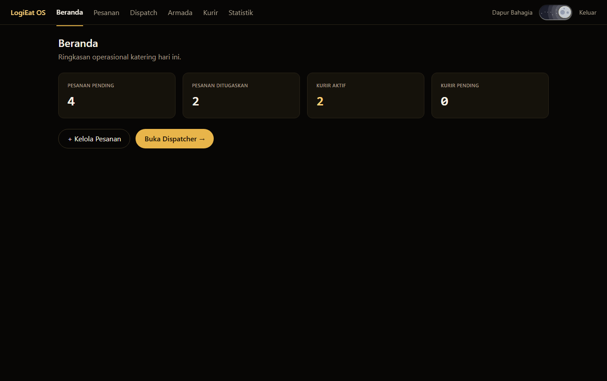

# LogiEat OS — Admin Web (Laravel + Inertia + React)

Dashboard web katering untuk **owner/admin**: kelola pesanan, **dispatch AI**, pantau armada,
approve kurir, dan analitik. Ini deliverable utama **UAS Web Programming**.

## Tampilan


## Fitur Utama (LO1)
- Auth + **multi-tenant** (owner/admin/kurir, isolasi per katering)
- **Manajemen pesanan** (CRUD + kode otomatis)
- **AI Dispatch** (pilih kurir + pesanan → rute optimal)
- **Armada Live** (peta posisi kurir + chat)
- **Approve kurir** (via Catering ID) & **analitik** (penjualan, on-time, rekap kurir)

## Teknologi (LO2)
**Laravel 12 + Inertia.js + React + Vite + Tailwind + Eloquent ORM + MySQL**.
Menunjukkan: routing (`routes/web.php`, `routes/api.php`), MVC (Controller → Model → View Inertia),
middleware (JWT + multi-tenant global scope), Eloquent + migrasi, dan SPA via Inertia.

## Integrasi AI (LO3)
Dispatch memanggil `backend-go` → `ai-service` (model **A2C** untuk routing spoilage-aware).
Detail: [`../docs/UAS-NOTES.md`](../docs/UAS-NOTES.md) Bagian A.

## ERD


## Struktur
```
app/Http/Controllers/   AuthController, OrderController, Web/{Dashboard,Dispatch,Fleet,...}Controller
app/Models/             Company, User, Order, Route, RouteAssignment (Eloquent)
app/Http/Middleware/    JwtAuthenticate, BindTenant, EnsureActive
database/migrations/    skema (UUID, ENUM inline)
resources/js/Pages/     Dashboard, Orders, Dispatch, Fleet, Couriers, Statistik (React/Inertia)
routes/                 web.php (Inertia) · api.php (JSON untuk mobile)
```

## Menjalankan
```bash
cp .env.example .env             # DB_DATABASE=logieat
composer install
npm install && npm run build
php artisan migrate --seed       # skema + akun demo + pesanan contoh
php artisan serve                # http://localhost:8000
```
Untuk fitur **Dispatch AI**, jalankan juga `../ai-service` (port 9000) dan `../backend-go` (port 8080).

Akun demo: `owner@bahagia.id` / `password` (owner) · `budi@bahagia.id` / `password` (kurir).
