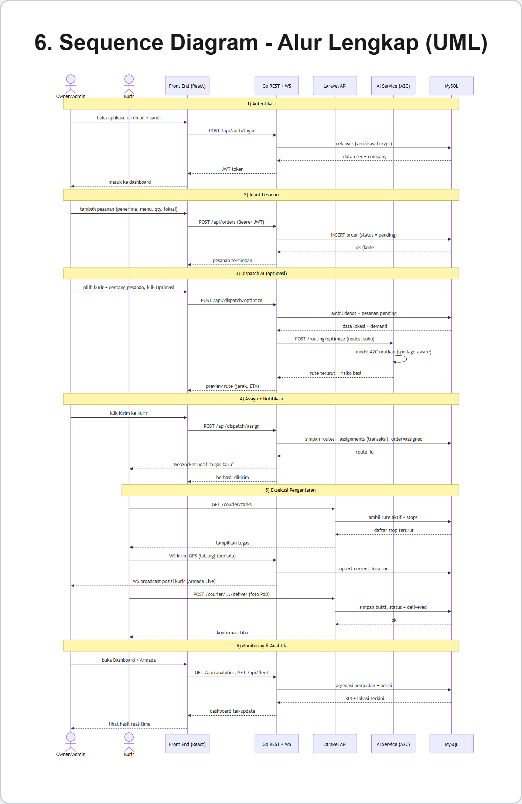

# LogiEat OS — AI Service (FastAPI + PyTorch)

Microservice **AI** untuk LogiEat OS. Menyediakan optimasi rute sadar-kebasian (spoilage-aware).
Dipanggil oleh `backend-go` (dan via Laravel) saat dispatch. Port **9000**.

## Kemampuan AI
| Endpoint | Model / Library | Fungsi |
|---|---|---|
| `POST /routing/optimize` | **PyTorch A2C** (Actor-Critic RL) + heuristik Q10 | Urutkan antar: makanan cepat basi didahulukan; suhu menaikkan urgensi |
| `GET /health` | — | Status service + device |

> Endpoint `/routing/optimize` **berjalan tanpa API key** (memakai model A2C lokal / heuristik).

## Peran dalam alur dispatch


## Teknologi
- **Python + FastAPI + Uvicorn**
- **PyTorch** (model A2C `a2c_best.pth`)
- Model fisika kebasian **Q10** (suhu → laju basi)

## Menjalankan
```bash
python -m venv .venv
.venv\Scripts\activate            # Windows
pip install -r requirements.txt
python app.py                     # port 9000
```
Konfigurasi opsional lewat `.env` (lihat `app.py`): `A2C_WEIGHTS_PATH`, dll.
