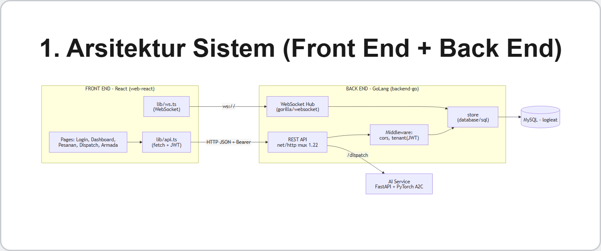
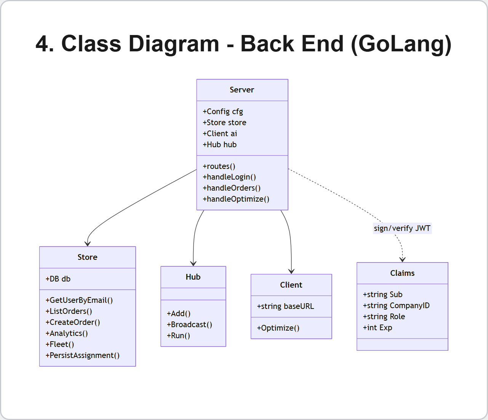
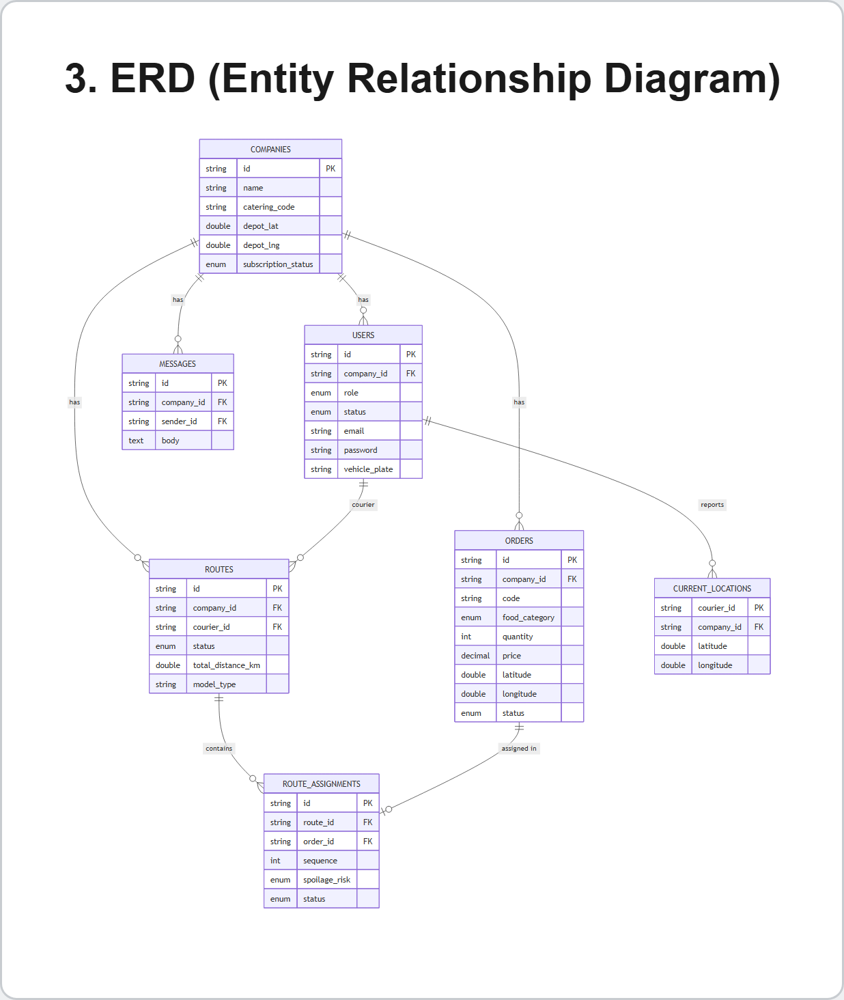

# LogiEat OS — Backend (GoLang REST API + WebSocket)

Back end inti LogiEat OS: **REST API** dan **WebSocket realtime** yang ditulis dengan **GoLang**.
Melayani autentikasi, pesanan, kurir, analitik, **dispatch AI** (jembatan ke `ai-service`), dan
**pelacakan armada real-time**. Berbagi satu database MySQL dengan Laravel.

## Arsitektur Sistem


## Teknologi
- **Go 1.22** `net/http` (routing method-pattern, tanpa framework)
- **MySQL** via `database/sql` + `go-sql-driver/mysql`
- **JWT HS256** (stdlib `crypto/hmac`) + **bcrypt** (`golang.org/x/crypto`)
- **WebSocket** `gorilla/websocket`
- **CORS** middleware (agar bisa dipanggil front end React di origin berbeda)

## Struktur Folder
```
cmd/server/main.go          # entry point + loader .env
internal/
├─ server/   routes.go, api.go, dispatch.go, ws.go, middleware.go, server.go
├─ store/    store.go, api_store.go   # query MySQL (database/sql)
├─ auth/     jwt.go                   # sign & verify HS256
├─ ws/       hub.go                   # WebSocket hub (goroutine)
├─ ai/       ai.go                    # client ke ai-service (A2C)
├─ db/       db.go
└─ config/   config.go               # baca env
```

## Endpoint REST
| Method | Path | Fungsi |
|---|---|---|
| POST | `/api/auth/login` | verifikasi bcrypt → terbitkan JWT |
| GET | `/api/me` | profil user + company |
| GET | `/api/orders` | daftar pesanan (tenant-scoped) |
| POST | `/api/orders` | tambah pesanan |
| GET | `/api/couriers` | daftar kurir |
| GET | `/api/analytics` | KPI + tren penjualan + rekap kurir |
| GET | `/api/fleet` | depot + posisi kurir |
| POST | `/api/dispatch/optimize` | optimasi rute (jembatan ke AI A2C) |
| POST | `/api/dispatch/assign` | simpan rute + notifikasi kurir |
| GET | `/ws` | realtime GPS + chat (auth via `?token=`) |

## Class Diagram (Back End)


## ERD (Database)


## Sequence — Dispatch AI (client–server)


## Menjalankan
```bash
# pastikan MySQL (Laragon) jalan & DB `logieat` sudah di-migrate+seed dari admin-laravel
go run ./cmd/server          # port 8080
```
Konfigurasi lewat `.env` (lihat `.env.example`). **`JWT_SECRET` wajib sama** dengan
`admin-laravel/.env`.

```env
PORT=8080
DB_DSN=root:@tcp(127.0.0.1:3306)/logieat?parseTime=true&loc=UTC
AI_SERVICE_URL=http://127.0.0.1:9000
JWT_SECRET=logieat-dev-shared-secret-change-in-prod
```

Konsep yang ditunjukkan: REST routing, middleware (CORS + JWT tenant), akses DB + transaksi,
concurrency (goroutine hub WebSocket), dan integrasi service AI.
