# LogiEat OS — 

Satu produk (**LogiEat OS**) dipakai untuk dua mata kuliah. Dokumen ini memetakan setiap
**Learning Outcome (LO)** ke **fitur + file kode** sebagai bahan jawaban, outline **PPT**, dan outline **laporan**.

| UAS | Teknologi | Folder | Akun demo |
|---|---|---|---|
| **WP — Web Programming** | Laravel + Inertia + React | `admin-laravel/` | `owner@bahagia.id` / `password` |
| **PPT — Popular Programming Technology** | GoLang (REST API) + React | `backend-go/` + `web-react/` | sama (login via Go) |

> Keduanya berbagi **satu database MySQL** (`logieat`) dan **satu JWT secret**, jadi konsisten.
> Seed data: `cd admin-laravel && php artisan migrate --seed`.

---

# BAGIAN A — UAS Web Programming (Laravel)  `admin-laravel/`

> Produk: **dashboard web katering** untuk owner/admin — kelola pesanan, dispatch AI, armada, analitik.

## LO1 (30%) — Tentukan fitur utama yang paling pas

Fitur dipilih dari masalah nyata katering besar (puluhan kurir, ratusan pesanan, makanan cepat basi):

| Fitur | Kenapa dipilih | File kunci |
|---|---|---|
| **Auth + multi-tenant** (owner/admin/kurir, isolasi per katering) | Wajib SaaS; tiap katering tak boleh lihat data katering lain | `app/Http/Middleware/JwtAuthenticate.php`, `app/Models/Concerns/BelongsToCompany.php` |
| **Manajemen Pesanan** (CRUD + kode otomatis) | Inti operasional katering | `app/Http/Controllers/Web/OrderWebController.php`, `app/Models/Order.php` |
| **AI Dispatch** (pilih kurir + pesanan → rute optimal) | Pembeda utama; otomatisasi pembagian tugas | `app/Http/Controllers/Web/DispatchController.php` |
| **Armada Live** (peta posisi kurir + chat) | Pantau lapangan real-time | `app/Http/Controllers/Web/FleetController.php` |
| **Approve Kurir** (via Catering ID) | Kontrol siapa yang boleh gabung | `app/Http/Controllers/Web/CourierWebController.php` |
| **Analitik** (penjualan, on-time, rekap kurir) | Pengambilan keputusan owner | `app/Http/Controllers/Web/AnalyticsController.php` |

Argumen LO1: fitur difokuskan ke **alur uang & operasional** (order → dispatch → antar → analitik), bukan fitur hiasan.

## LO2 (40%) — Buat & rancang website menggunakan Laravel

Stack: **Laravel 12 + Inertia.js + React + Vite + Tailwind + Eloquent ORM + MySQL**.

Konsep web programming yang ditunjukkan (untuk dijelaskan saat sidang):

- **Routing**: `routes/web.php` (halaman Inertia) & `routes/api.php` (JSON untuk mobile).
- **MVC**: Controller (`app/Http/Controllers/...`) → Model Eloquent (`app/Models/...`) → View (Inertia React `resources/js/Pages/...`).
- **Middleware**: `JwtAuthenticate` (autentikasi), `BindTenant` / `BelongsToCompany` (multi-tenancy global scope), `EnsureActive` (cek langganan).
- **ORM & Migrasi**: `database/migrations/*` (skema, ENUM inline, UUID), relasi Eloquent (Company hasMany User/Order/Route).
- **Auth JWT**: `app/Services/JwtService.php` menerbitkan token HS256.
- **SPA via Inertia**: server-side routing + komponen React tanpa REST manual → `resources/js/Pages/{Dashboard,Orders,Dispatch,Fleet,Couriers,Statistik}.jsx`, layout `resources/js/Layout.jsx`.
- **Build tool**: Vite (`vite.config.js`), Tailwind tokens (`resources/css/app.css`).

Cara jalan: `composer install && npm install && npm run build` → `php artisan serve` → buka di browser.

## LO3 (30%) — Gunakan library/plugin AI yang paling sesuai

AI berada di microservice **`ai-service/app.py` (FastAPI + PyTorch)**, dipanggil oleh backend:

| Kemampuan AI | Library/Model | Endpoint | Dipakai untuk |
|---|---|---|---|
| **Routing spoilage-aware** | **PyTorch A2C** (Actor-Critic RL) + heuristik Q10 | `POST /routing/optimize` | Urutkan antar: makanan cepat basi didahulukan (suhu menaikkan urgensi) |
| **Vision OCR struk** | **NVIDIA NIM — Llama 3.2 Vision** | `POST /vision/analyze/` | Ekstrak bahan + estimasi basi dari foto struk/inventory |
| **Saran menu & klasifikasi** | **NVIDIA NIM — Nemotron / Llama 3.x** | `POST /decision/suggest-menu`, `/decision/calculate-epsilon` | Rekomendasi menu bergizi & kategori basi |

Alur AI dari Laravel: admin pilih kurir+pesanan → **Go core** (`/dispatch/optimize`) → **app.py A2C** → hasil rute dikembalikan & disimpan. (Lihat sequence diagram di Bagian B.)

Argumen LO3: dipilih **RL (A2C) untuk optimisasi rute** (bukan sekadar API LLM) karena masalahnya adalah *sequential decision/optimization*, plus **Vision/LLM (NVIDIA NIM)** untuk input tak terstruktur (foto struk) — keduanya paling sesuai kebutuhan logistik makanan.

---

# BAGIAN B — UAS Popular Programming Technology (Go + React)  `backend-go/` + `web-react/`

> Produk: **REST API GoLang** + **frontend React** terpisah (client-server), berbagi DB dengan Laravel.

## LO1 (30%) — Arsitektur (UML, class, use case, ERD)

### Diagram (file gambar siap pakai untuk laporan/PPT)
Pakai **SVG (vektor — tajam, tidak pecah saat di-zoom; bisa di-Insert > Picture ke Word/PowerPoint)**.
PNG resolusi tinggi disediakan sebagai cadangan. Semua di [`docs/diagrams/`](diagrams/).

| # | Diagram | SVG (tajam, dipakai) | PNG (cadangan) |
|---|---------|----------------------|----------------|
| 1 | Arsitektur Sistem (front+back) | [01-arsitektur.svg](diagrams/01-arsitektur.svg) | [.png](diagrams/01-arsitektur.png) |
| 2 | Use Case (UML) | [02-use-case.svg](diagrams/02-use-case.svg) | [.png](diagrams/02-use-case.png) |
| 3 | ERD | [03-erd.svg](diagrams/03-erd.svg) | [.png](diagrams/03-erd.png) |
| 4 | Class — Back End (Go) | [04-class-backend.svg](diagrams/04-class-backend.svg) | [.png](diagrams/04-class-backend.png) |
| 5 | Class — Front End (React) | [05-class-frontend.svg](diagrams/05-class-frontend.svg) | [.png](diagrams/05-class-frontend.png) |
| 6 | Sequence — alur lengkap (UML) | [06-sequence.svg](diagrams/06-sequence.svg) | [.png](diagrams/06-sequence.png) |

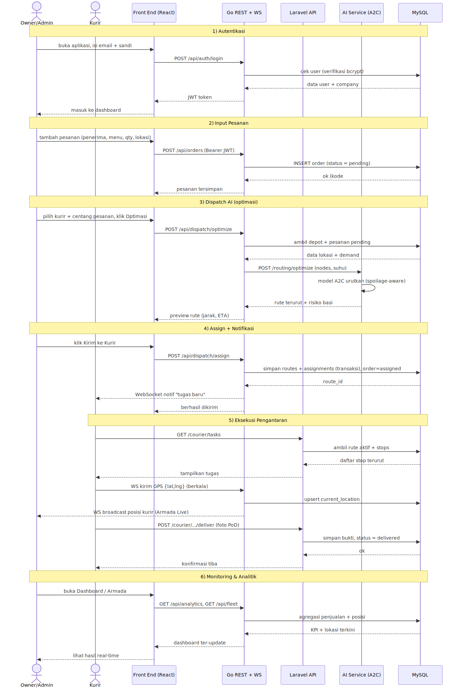

> Regenerasi: `cd ad && node render_diagrams.mjs` (sumber Mermaid: `docs/diagrams.html`).

### Arsitektur sistem (komponen) — sumber Mermaid
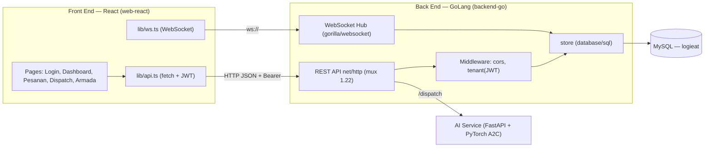

### Use Case Diagram
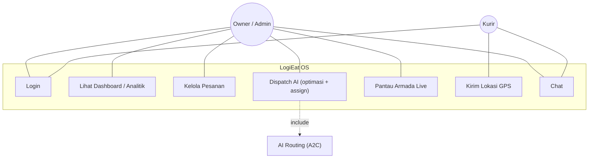

### ERD
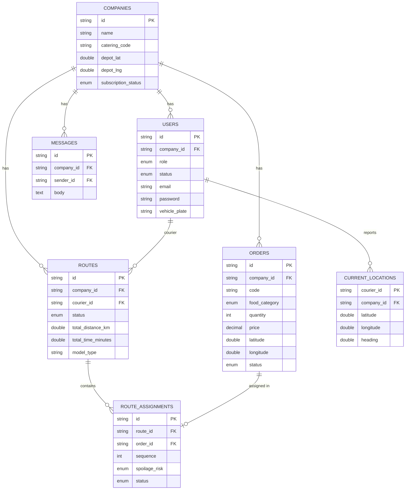

### Class Diagram (Go back end)
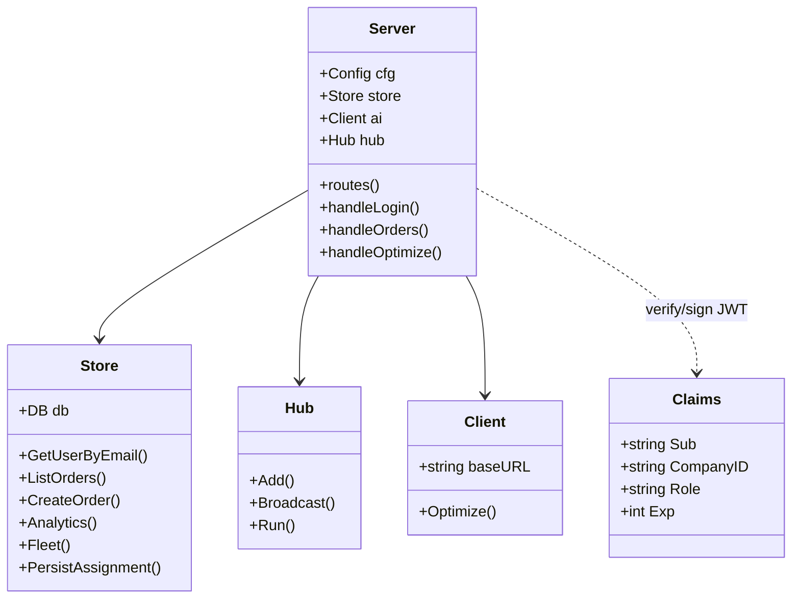

### Sequence — Dispatch AI (client-server, LO3 synthesis)
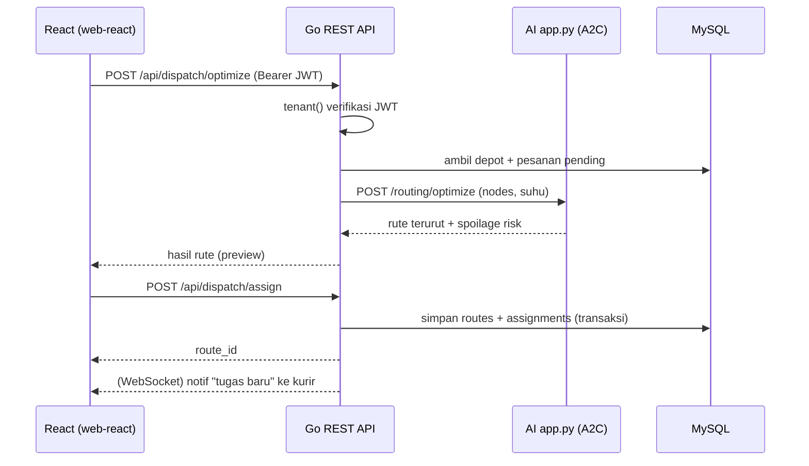

## LO2 (40%) — REST API GoLang + hubungkan ke React

### REST API (GoLang) — `backend-go/`
Struktur: `cmd/server/main.go` (entry + .env loader) → `internal/server/` (routes, handlers, middleware, ws) → `internal/store/` (query SQL) → `internal/auth/` (JWT HS256 sign/verify).

Endpoint utama (semua JSON, auth Bearer kecuali login):

| Method | Path | Handler | Fungsi |
|---|---|---|---|
| POST | `/api/auth/login` | `handleLogin` | verifikasi bcrypt → terbitkan JWT |
| GET | `/api/me` | `handleMe` | profil user + company |
| GET | `/api/orders` | `handleOrders` | daftar pesanan (tenant-scoped) |
| POST | `/api/orders` | `handleCreateOrder` | tambah pesanan |
| GET | `/api/couriers` | `handleCouriers` | daftar kurir |
| GET | `/api/analytics` | `handleAnalytics` | KPI + tren + rekap kurir |
| GET | `/api/fleet` | `handleFleet` | depot + posisi kurir |
| POST | `/api/dispatch/optimize` | `handleOptimize` | jembatan ke AI A2C |
| POST | `/api/dispatch/assign` | `handleAssign` | simpan rute + notif |
| GET | `/ws` | `handleWS` | realtime GPS + chat |

Konsep back end yang ditunjukkan: **routing method-pattern (Go 1.22 `net/http`)**, **middleware** (`cors`, `tenant`), **JWT** (stdlib HMAC-SHA256, `internal/auth/jwt.go`), **akses DB** (`database/sql` + driver MySQL), **transaksi** (`PersistAssignment`), **concurrency** (goroutine WebSocket hub), **CORS** (agar browser React boleh memanggil — beda dari mobile).

Cara jalan: `cd backend-go && go run ./cmd/server` (port 8080).

### Front End (React) — `web-react/`
Stack: **Vite + React + TypeScript + React Router + MapLibre GL**.

Konsep front end yang ditunjukkan: **SPA + client-side routing** (`App.tsx`), **state & hooks** (`useState/useEffect/Context`), **auth context + protected route** (`lib/auth.tsx`), **fetch API client** (`lib/api.ts`), **konsumsi REST** di tiap page, **realtime WebSocket** (`lib/ws.ts` + `pages/Fleet.tsx`), **komponen & props** (`components/Layout.tsx`, pages), **render data** (tabel, chart SVG, peta).

Halaman: `Login`, `Dashboard` (analitik), `Pesanan` (tabel + tambah), `Dispatch` (AI), `Armada Live` (peta + WS).

Cara jalan: `cd web-react && npm install && npm run dev` (port 5173) — atau `npm run build && npm run preview`.

### Bukti koneksi client-server (LO2/LO3 synthesis)
React (`lib/api.ts`) memanggil `http://localhost:8080/api/*` dengan header `Authorization: Bearer <JWT>`; Go memvalidasi JWT (`tenant`), query MySQL, balas JSON; untuk Armada, React buka `ws://localhost:8080/ws?token=` dan Go mem-broadcast lokasi kurir secara real-time. Screenshot bukti ada di `docs/uas-web-screenshots/`.

## Outline PPT (PPT/Popular Tech)
1. Judul + arsitektur client-server
2. Diagram (use case, ERD, class, sequence) (LO1)
3. REST API GoLang: struktur + endpoint (LO2)
4. React: struktur + cara konsumsi REST + WebSocket (LO2)
5. Demo: login → dashboard → dispatch AI → armada live
6. Kesimpulan (sintesis client-server, LO3)

## Outline Laporan (PPT/Popular Tech)
1. Pendahuluan
2. Analisis & perancangan: arsitektur, use case, class, ERD, sequence (LO1)
3. Implementasi back end GoLang REST API (LO2)
4. Implementasi front end React + integrasi (LO2)
5. Pengujian (skenario + screenshot)
6. Kesimpulan (Create client-server application, LO3)

---

## Cara menjalankan keduanya (ringkas)
```bash
# 0) DB (Laragon MySQL) + seed
cd admin-laravel && php artisan migrate --seed

# 1) AI service (untuk Dispatch AI)
cd ai-service && .venv/Scripts/python.exe app.py        # :9000

# 2) Go REST API
cd backend-go && go run ./cmd/server                    # :8080

# 3a) UAS Web Programming — Laravel
cd admin-laravel && php artisan serve                    # :8000/8001

# 3b) UAS Popular Tech — React (konsumsi Go)
cd web-react && npm install && npm run dev               # :5173
```
