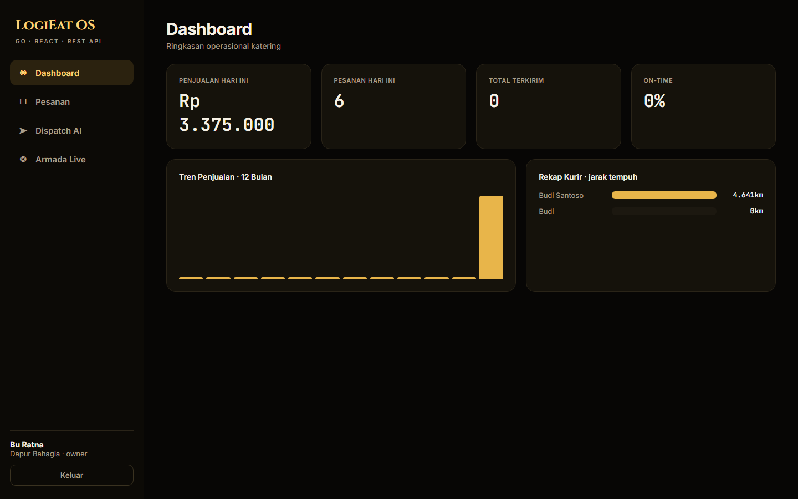
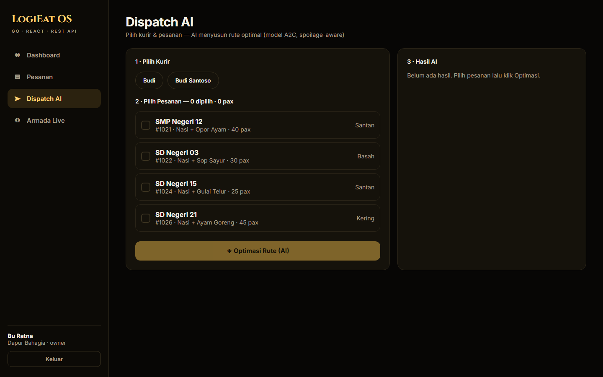
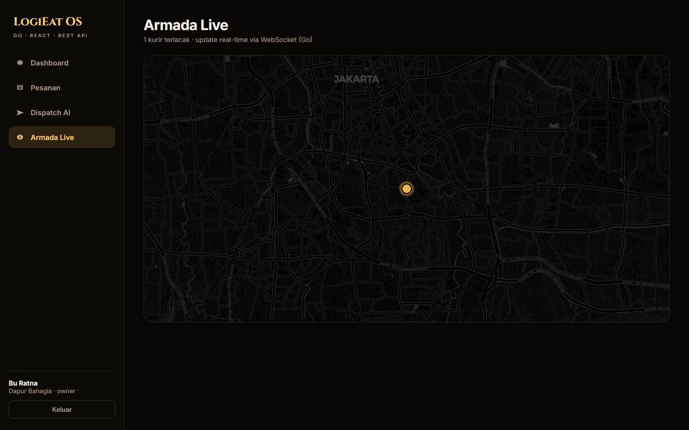
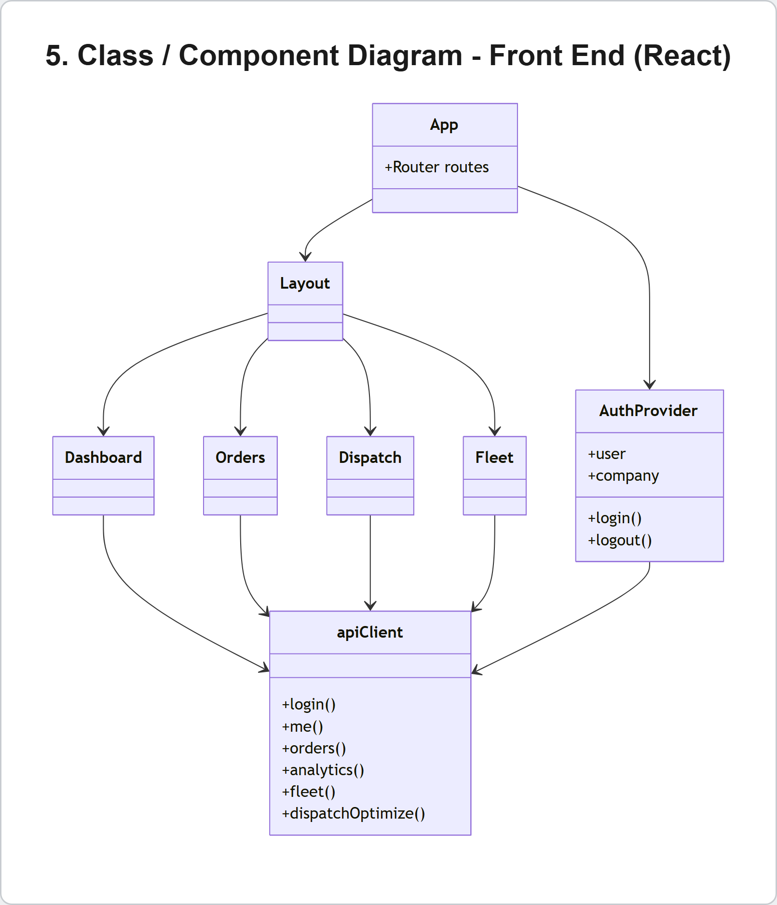

# LogiEat OS — Web (React + Go REST API)

Front end **web** LogiEat OS: **React (Vite + TypeScript)** yang sepenuhnya mengonsumsi
**REST API GoLang** (`../backend-go`) + **WebSocket** — arsitektur **client–server** murni.

## Tampilan
| Dashboard | Dispatch AI | Armada Live |
|---|---|---|
|  |  |  |

## Class / Component Diagram (Front End)


## Teknologi
- **React 18 + Vite + TypeScript**
- **React Router** (client-side routing + protected route)
- **MapLibre GL** (peta armada)
- **Fetch API** + **JWT** Bearer, **WebSocket** untuk realtime

## Struktur
```
src/
├─ lib/        api.ts (REST client), auth.tsx (Context + JWT), ws.ts (WebSocket)
├─ pages/      Login, Dashboard, Orders, Dispatch, Fleet
├─ components/ Layout (sidebar + protected outlet)
└─ App.tsx     routing
```

## Menjalankan
```bash
# 1) backend Go (port 8080) + ai-service (port 9000) harus jalan dulu
cd ../backend-go && go run ./cmd/server

# 2) front end React (port 5173)
npm install
npm run dev
```
Base URL API diatur lewat `VITE_API_URL` (default `http://localhost:8080`).

Login demo: `owner@bahagia.id` / `password` (owner) · `budi@bahagia.id` / `password` (kurir).

## Halaman
- **Login** — autentikasi ke `/api/auth/login`, simpan JWT.
- **Dashboard** — KPI + tren penjualan + rekap kurir (`/api/analytics`).
- **Pesanan** — tabel + tambah pesanan (`/api/orders`).
- **Dispatch AI** — pilih kurir + pesanan → `/api/dispatch/optimize` (model A2C) → assign.
- **Armada Live** — peta MapLibre + posisi kurir real-time via WebSocket.
